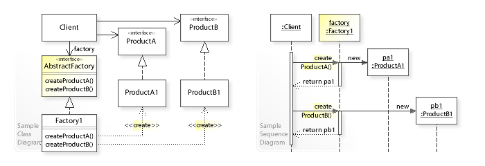
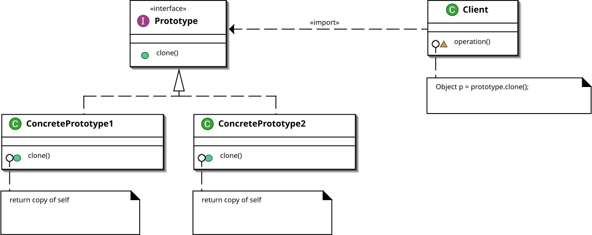
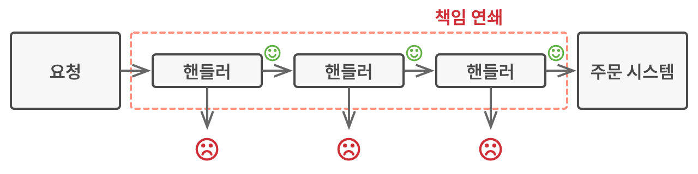
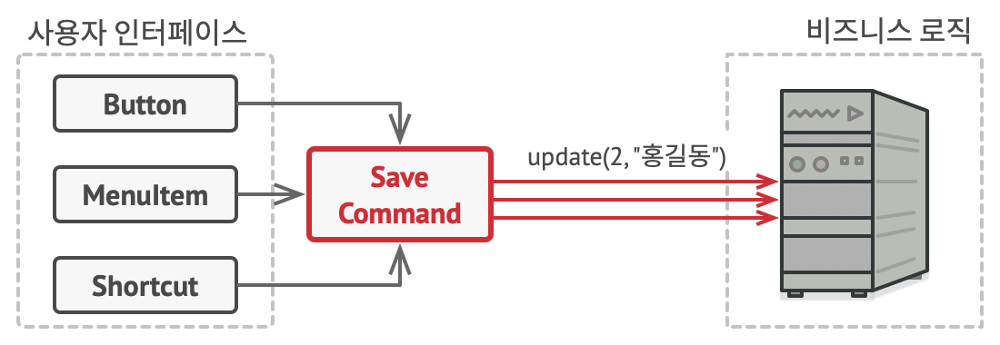
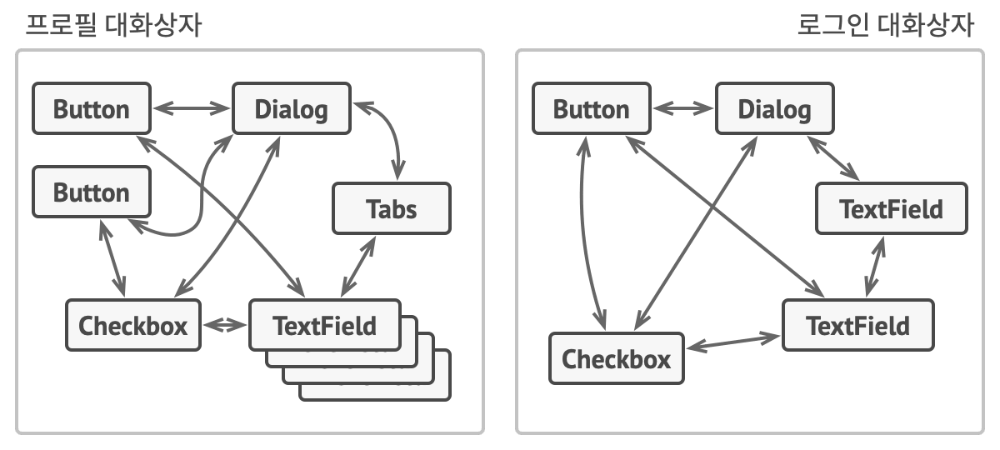
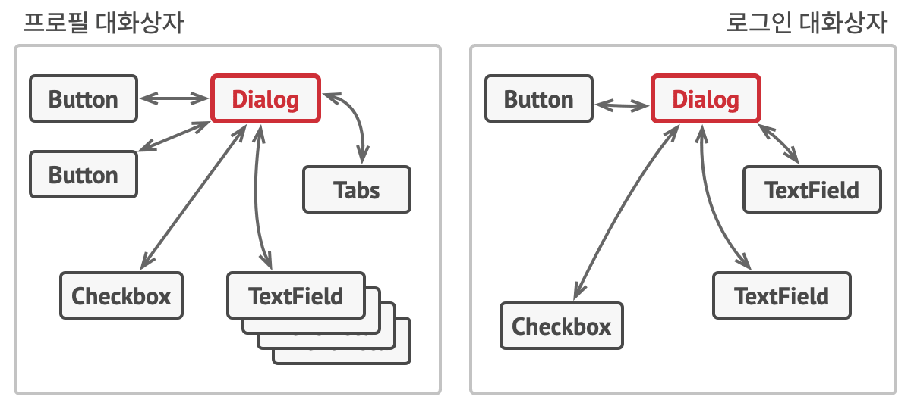

# 18가지 필수 디자인 패턴
<br>

<hr>

**목차**
1. 생성 패턴 (Creational Patterns)
2. 구조 패턴 (Structural Patterns)
3. 행위 패턴 (Behavioral Patterns)
<hr>

## 1. 생성 패턴 (Creational Patterns)
객체 생성의 유연성과 재사용성을 높이기 위한 디자인 패턴

### 1-1. 추상 팩토리 (Abstract Factory)

**개념**
- 추상화와 구현을 분리하여 두 부분이 독립적으로 변화할 수 있게 하는 패턴

**장점**
- 저장소 구현 변경이 쉬움
- 코드 재사용성 향상
- 새로운 저장 방식 추가가 용이

**단점**
- 계층 구조가 복잡해질 수 있음
- 클래스 수 증가

**UML**  


**구현 예시**
```typescript
// validationTypes.ts
export interface ValidationResult {
    isValid: boolean;
    errorMessage?: string;
}


// authValidation.ts
import {ValidationResult} from "./validationTypes";

export const validateEmail = (email: string): ValidationResult => {
    ...

    return {
        isValid: false,
        errorMessage: '*올바른 이메일 주소 형식을 입력해주세요 (예: example@example.com)'
    };
};

export const validatePassword = (password: string): ValidationResult => {
    ...

    return {
        isValid: false,
        errorMessage: '*비밀번호가 다릅니다.'
    };
};

```

### 1-2. 빌더 (Builder)

**개념**
- 복잡한 객체의 생성 과정과 표현 방법을 분리하여 단계적으로 객체를 생성
- 게시글처럼 여러 필수/선택 필드를 가진 객체 생성에 적합

**장점**
- 게시글 생성 과정의 세밀한 제어 가능
- 유효성 검사를 빌더 내에서 처리
- 코드 가독성 향상

**단점**
- 별도의 빌더 클래스 필요
- 간단한 객체 생성에는 과도한 패턴일 수 있음

**구현 예시**
```typescript
// builder 미사용시
const post = new Post('제목~!', '내용~!', 'hyuk.kim (김상혁)');

// builder 사용시
const post = new PostBuilder()
 .setTitle('제목~!')
 .setBody('내용~!')
 .setAuthor('hyuk.kim (김상혁)')
 .build();
```

### 1-3. 프로토타입 (Prototype)

**개념**
- 기존 객체를 복제하여 새로운 객체를 생성하는 패턴
- 자주 사용되는 게시글 형식을 템플릿으로 만들어 재사용

**장점**
- 자주 사용되는 형식의 게시글을 쉽게 생성
- 템플릿 수정이 용이
- 객체 생성 비용 절감

**단점**
- 순환 참조가 있는 복잡한 객체의 복제가 어려움
- 깊은 복사 구현의 복잡성

**UML**


**구현 예시**
```javascript
// 프로토타입 패턴 예시
class PostTemplate {
  constructor(title, content) {
    this.title = title;
    this.content = content;
  }

  clone() {
    return new PostTemplate(this.title, this.content);
  }
}

// 사용
const template = new PostTemplate("[공지] ", "기본 내용");
const newPost = template.clone();
```

<br>

> **프로토타입 vs 추상화**
>- 프로토타입  
   기존 객체를 복제하여 새로운 객체를 생성하는 것이 목적  
   객체 생성 비용을 줄이고 복잡한 객체를 효율적으로 생성  
> <br>  
>- 추상화  
   복잡한 시스템을 단순화하고 핵심 개념만 남기는 것이 목적  
   구현 세부사항을 숨기고 인터페이스를 통해 기능 제공

### 1-4. 싱글톤 (Singleton)

**개념**

- 클래스의 인스턴스가 오직 하나만 생성되도록 보장하고 전역적인 접근점 제공
- 사용자 세션, 설정 관리 등 공유 리소스 관리에 적합

**장점**

- 인스턴스의 유일성 보장
- 전역적 접근점 제공
- 공유 리소스에 대한 동시성 제어 용이

**단점**

- 단위 테스트의 어려움
- 전역 상태로 인한 코드 결합도 증가
- 동시성 처리 시 주의 필요

**구현 예시**
```javascript
class UserStore {
 constructor() {
   if (UserStore.instance) {
     return UserStore.instance;
   }
   this.user = null;
   UserStore.instance = this;
 }

 static getInstance() {
   if (!UserStore.instance) {
     UserStore.instance = new UserStore();
   }
   return UserStore.instance;
 }

 setUser(userData) {
   this.user = userData;
 }

 getUser() {
   return this.user;
 }

 logout() {
   this.user = null;
 }
}

// 사용 예시
const userStore = UserStore.getInstance();

// 로그인 시
userStore.setUser({
 id: 'hyuk123',
 name: 'Hyuk kim',
 email: 'hyuk@kakao.com'
});

// 유저 정보 가져오기
console.log(userStore.getUser()); // {id: 'user123', name: 'John Doe', ...}

// 로그아웃
userStore.logout(); // user = null
```

<hr>

## 2. 구조 패턴 (Structural Patterns)
클래스와 객체를 더 큰 구조로 조합하는 방법을 다루는 디자인 패턴

### 2-1. 어댑터 (Adapter)

- 외부 인증 시스템 통합

**개념**
- 호환되지 않는 인터페이스들을 함께 동작하도록 만드는 패턴
- 서로 다른 인증 시스템(Google, Kakao, Naver 등)을 통합할 때 유용

**장점**
- 기존 코드 수정 없이 새로운 인증 시스템 추가 가능
- 인증 로직의 일관성 유지
- 코드 재사용성 증가

**단점**
- 어댑터 클래스 추가로 인한 복잡도 증가
- 새로운 인증 시스템마다 어댑터 구현 필요

**구현 예시**
```javascript
// 외부 인증 서비스 인터페이스
interface AuthenticationProvider {
  authenticate(credentials: any): Promise<AuthResult>;
  validateToken(token: string): Promise<boolean>;
  getUserInfo(token: string): Promise<UserInfo>;
}

// Google OAuth (외부 서비스로부터 토큰, 유저 정보 받아오는 클래스)
class GoogleOAuth {
  async verifyGoogleToken(token: string) {
    return { verified: true, sub: 'google_user_id' };
  }

  async getGoogleUserProfile(token: string) {
    return { name: 'Hyuk Kim', email: 'hyuk@gmail.com' };
  }
}

// Google OAuth Adapter
class GoogleAuthAdapter implements AuthenticationProvider {
  private googleOAuth: GoogleOAuth;

  constructor() {
    this.googleOAuth = new GoogleOAuth();
  }

  async authenticate(credentials: { token: string }) {
    const result = await this.googleOAuth.verifyGoogleToken(credentials.token);
    return {
      success: result.verified,
      userId: result.sub
    };
  }

  async validateToken(token: string) {
    const result = await this.googleOAuth.verifyGoogleToken(token);
    return result.verified;
  }

  async getUserInfo(token: string) {
    const profile = await this.googleOAuth.getGoogleUserProfile(token);
    return {
      name: profile.name,
      email: profile.email,
      provider: 'google'
    };
  }
}
```

### 2-2. 브리지 (Bridge)

**개념**

- 추상화와 구현을 분리하여 둘을 독립적으로 변형할 수 있게 하는 패턴
- 저장소의 구현(데이터베이스, 파일 시스템, 캐시 등)과 게시글 관리 로직을 분리

**장점**

- 저장소 구현 변경이 용이
- 새로운 저장소 추가가 쉬움
- 코드의 결합도 감소

**단점**

- 복잡한 계층 구조 생성 가능
- 초기 설계가 어려울 수 있음

구현 예시
```javascript
// 게시글 저장소
// 추상화 계층
class PostRepository {
   // storage는 브릿지 역할! (Repository와 Storage를 연결)
  constructor(storage) { 
    this.storage = storage;
  }
  
  save(post) {
    return this.storage.write(post);
  }
  
  load(id) {
    return this.storage.read(id);
  }
}

// 구현 계층
class LocalStorage {
  write(data) { /* 로컬 저장 구현 */ }
  read(id) { /* 로컬 읽기 구현 */ }
}

class CloudStorage {
  write(data) { /* 클라우드 저장 구현 */ }
  read(id) { /* 클라우드 읽기 구현 */ }
}

// 사용
const repository = new PostRepository(new CloudStorage());
```

### 2-3. 컴포지트 (Composite)

**개념**

- 객체들을 트리 구조로 구성하여 부분-전체 계층 구조를 구현하는 패턴
- 댓글과 대댓글 같은 계층적 구조 구현에 적합

**장점**

- 복잡한 트리 구조 쉽게 구현
- 새로운 종류의 구성 요소 추가 용이
- 클라이언트 코드 단순화

**단점**

- 제약 조건 설계 어려움
- 트리 구조 변경의 복잡성

**구현 예시**

```javascript
// 댓글 시스템
javascriptCopyclass Comment {
    constructor(content) {
       this.content = content;
       this.replies = [];
    }
    
    addReply(comment) {
        this.replies.push(comment);
    }
    
    display(depth = 0) {
       console.log('  '.repeat(depth) + this.content);
       this.replies.forEach(reply => reply.display(depth + 1));
    }
}
```

### 2-4. 데코레이터 (Decorator)

**개념**

* 객체에 동적으로 새로운 책임을 추가하는 패턴
* 게시글에 권한, 검증, 로깅 등의 기능을 동적으로 추가할 때 유용

**장점**

* 기존 코드 수정 없이 기능 추가 가능
* 단일 책임 원칙 준수
* 실행 중에 기능 추가/제거 가능

**단점**

* 데코레이터 순서에 따라 결과가 달라질 수 있음
* 작은 객체가 많이 생성될 수 있음

**구현 예시**
```javascript
// 게시글 권한 관리

class Post {
    constructor(content) {
        this.content = content;
    }
}

class AuthDecorator {
    constructor(post) {
        this.post = post;
    }

    display(user) {
        if (this.checkPermission(user)) {
            return this.post.content;
        }
        return "접근 권한이 없습니다.";
    }

    checkPermission(user) {
        // 권한 검사 로직
        return user.hasPermission;
    }
}
```

### 2-5. 퍼사드 (Facade)

**개념**

* 복잡한 서브시스템에 대한 단순화된 인터페이스 제공
* 회원가입, 인증, 프로필 관리 등 복잡한 기능을 단순화

**장점**

* 서브시스템 사용 편의성 증가
* 서브시스템 간 결합도 감소
* 클라이언트 코드 단순화

**단점**

* 퍼사드가 모든 서브시스템을 알아야 함
* 추가적인 계층으로 인한 간접 호출

**구현 예시**
```javascript
// 회원 관리 시스템

class UserFacade {
    constructor() {
        this.auth = new AuthService();
        this.profile = new ProfileService();
        this.notification = new NotificationService();
    }

    async register(userData) {
        const user = await this.auth.createUser(userData);
        await this.profile.createProfile(user.id);
        await this.notification.sendWelcomeEmail(user.email);
        return user;
    }
}
```

```javascript
// 퍼샤드를 사용하지 않았을 경우!
class SignupComponent {
    async handleSignup(formData) {
        try {
            // AuthService 직접 다루기
            const authService = new AuthService();
            const user = await authService.createUser({
                email: formData.email,
                password: formData.password
            });
            
            // ProfileService 직접 다루기
            const profileService = new ProfileService();
            await profileService.createProfile(user.id, {
                name: formData.name,
                birthdate: formData.birthdate,
                address: formData.address
            });
            
            // NotificationService 직접 다루기
            const notificationService = new NotificationService();
            if (formData.marketingConsent) {
                await notificationService.subscribeToNewsletter(user.email);
            }
            await notificationService.sendWelcomeEmail(user.email);
            
            return user;
            
        } catch (error) {
            // 각 서비스별로 다른 에러 처리가 필요할 수 있음
            if (error instanceof AuthError) {
                // 인증 관련 에러 처리
            } else if (error instanceof ProfileError) {
                // 프로필 관련 에러 처리
                await authService.deleteUser(user.id); // 롤백 처리
            } else if (error instanceof NotificationError) {
                // 알림 관련 에러 처리
            }
        }
    }
}
```

<hr>

## 3. 행위 패턴 (Behavioral Patterns)
객체들이 서로 상호작용하고 책임을 분배하는 방식을 다루는 디자인 패턴

### 3-1. 플라이웨이트 (Flyweight)
**개념**

* 많은 수의 유사한 객체를 효율적으로 공유하여 메모리 사용을 최적화하는 패턴
* 자주 조회되는 게시글이나 댓글의 캐싱에 활용

**장점**

* 메모리 사용량 감소
* 객체 생성 비용 절감
* 성능 향상

**단점**

* 코드 복잡도 증가
* 공유 상태 관리의 어려움

**구현 예시**
```javascript
//  게시글 캐싱
constructor() {
    this.cache = new Map();
}
    
getPost(id) {
    if (!this.cache.has(id)) {
        this.cache.set(id, this.loadPost(id));
    }
    return this.cache.get(id);
}
```

<br>

**캐시와의 차이점!**  

| 특성 | 플라이웨이트 | 캐시 |
|------|------------|------|
| 주 목적 | 메모리 사용 최적화 | 접근 속도 향상 |
| 데이터 처리 | 공유 가능한 상태를 분리하여 재사용 | 계산 결과나 데이터를 임시 저장 |
| 수명 | 객체가 필요한 동안 계속 유지 | 일정 시간 후 삭제/갱신 가능 |
| 사용 시점 | 동일한 객체가 다수 필요할 때 | 비용이 많이 드는 연산 결과 재사용 시 |
| 구현 방식 | 팩토리를 통한 객체 공유 | 키-값 저장소 형태 |
| 상태 관리 | 내부 상태와 외부 상태 구분 | 결과값 전체를 저장 |
| 메모리 특성 | 공유를 통한 메모리 절약 | 추가 메모리 사용을 통한 속도 향상 |
<br>

### 3-2. 프록시 (Proxy)

**개념**
- 객체에 대한 접근을 제어하는 대리자 제공
- 게시글 접근 권한 검사, 지연 로딩 등에 활용

**장점**
- 보안성 향상
- 리소스 사용 최적화
- 객체 생성 및 접근 제어 용이

**단점**
- 응답 시간 지연 가능성
- 코드 복잡도 증가

**구현 예시**
```javascript
// 게시글 접근 제어
class PostProxy {
  constructor(realPost) {
    this.realPost = realPost;
  }

  view(user) {
    if (this.checkAccess(user)) {
      return this.realPost.content;
    }
    throw new Error('Access denied');
  }

  checkAccess(user) {
    return user.hasPermission(this.realPost.id);
  }
}
```

### 3-3. 책임 연쇄 (Chain of Responsibility)



**개념**
- 요청을 처리할 수 있는 기회를 여러 객체에게 부여
- 게시글의 스팸 필터링, 욕설 필터링 등에 활용

**장점**
- 처리 순서 동적 변경 가능
- 단일 책임 원칙 준수
- 새로운 처리 단계 추가 용이

**단점**
- 처리 단계가 많으면 성능 저하
- 처리 보장 안될 수 있음

**구현 예시**
```javascript
// 게시글 필터링
class ContentFilter {
  constructor() {
    this.nextFilter = null;
  }

  setNext(filter) {
    this.nextFilter = filter;
    return filter;
  }

  filter(content) {
    if (this.nextFilter) {
      return this.nextFilter.filter(content);
    }
    return content;
  }
}

class SpamFilter extends ContentFilter {
  filter(content) {
    // 스팸 필터링 로직
    return super.filter(content);
  }
}
```

### 3-4. 커맨드 (Command)



**개념**
- 요청을 객체로 캡슐화하여 매개변수화
- 게시글 작성, 수정, 삭제 등의 작업 관리에 활용

**장점**
- 작업의 큐잉과 로깅 가능
- 실행 취소/재실행 구현 용이
- 작업 상태 추적 가능

**단점**
- 클래스 수 증가
- 시스템 복잡도 증가

**구현 예시**
```javascript
// 게시글 관리
class PostCommand {
  constructor(post) {
    this.post = post;
  }

  execute() {}
  undo() {}
}

class CreatePostCommand extends PostCommand {
  execute() {
    return database.save(this.post);
  }

  undo() {
    return database.delete(this.post.id);
  }
}
```

### 3-5. 반복자 (Iterator)

**개념**
- 컬렉션의 내부 구조를 노출하지 않고 순차적으로 요소에 접근하는 방법 제공
- 게시글 목록의 페이지네이션, 무한 스크롤 구현에 활용

**장점**
- 일관된 순회 인터페이스 제공
- 순회 알고리즘 변경 용이
- 메모리 효율적인 데이터 접근

**단점**
- 단순한 순회에는 과도한 패턴
- 상태 관리 복잡도 증가

**구현 예시**
```javascript
// 게시글 페이지네이션
class PostIterator {
  constructor(posts, pageSize) {
    this.posts = posts;
    this.pageSize = pageSize;
    this.currentPage = 0;
  }

  hasNext() {
    return this.currentPage * this.pageSize < this.posts.length;
  }

  next() {
    const start = this.currentPage * this.pageSize;
    const end = start + this.pageSize;
    this.currentPage++;
    return this.posts.slice(start, end);
  }
}
```

### 3-6. 중재자 (Mediator)





**개념**
- 객체 간의 복잡한 통신을 중앙화하여 처리
- 실시간 채팅, 알림 시스템 구현에 활용

**장점**
- 객체 간 결합도 감소
- 상호작용 로직 중앙화
- 통신 로직 재사용 가능

**단점**
- 중앙화로 인한 병목 가능성
- 중재자 클래스 복잡도 증가

**구현 예시**
```javascript
// 실시간 알림 시스템
class NotificationMediator {
  constructor() {
    this.users = new Map();
  }

  register(user) {
    this.users.set(user.id, user);
  }

  notify(sender, message) {
    this.users.forEach(user => {
      if (user.id !== sender.id) {
        user.receive(message);
      }
    });
  }
}
```

### 3-7. 메멘토 (Memento)

**개념**
- 객체의 상태를 저장하고 복원하는 기능 제공
- 게시글 작성 중 임시저장, 실행취소 기능 구현에 활용

**장점**
- 상태 저장과 복원 캡슐화
- 실행취소 기능 구현 용이
- 객체 상태 이력 관리 가능

**단점**
- 메모리 사용량 증가
- 저장할 상태가 클 경우 비용 증가

**구현 예시**
```javascript
// 게시글 임시저장
class PostMemento {
  constructor(content) {
    this.content = content;
    this.savedTime = new Date();
  }
}

class Post {
  constructor() {
    this.content = '';
  }

  save() {
    return new PostMemento(this.content);
  }

  restore(memento) {
    this.content = memento.content;
  }
}
```

### 3-8. 옵저버 (Observer)

**개념**
- 객체의 상태 변화를 다른 객체에 자동으로 알리는 패턴
- 게시글 구독, 알림 설정 기능 구현에 활용

**장점**
- 느슨한 결합도 유지
- 상태 변경 자동 전파
- 런타임에 구독 관계 변경 가능

**단점**
- 순서 의존적인 갱신 처리 어려움
- 메모리 누수 가능성

**구현 예시**
```javascript
// 구독 시스템
class PostSubject {
  constructor() {
    this.observers = new Set();
  }

  attach(observer) {
    this.observers.add(observer);
  }

  notify(data) {
    this.observers.forEach(observer => {
      observer.update(data);
    });
  }
}
```

### 3-9. 방문자 (Visitor)

**개념**
- 객체 구조를 변경하지 않고 새로운 동작을 추가
- 게시글 통계, 분석 기능 구현에 활용

**장점**
- 기존 코드 수정 없이 새로운 동작 추가
- 관련 동작을 한 클래스에 모음
- 데이터와 알고리즘 분리

**단점**
- 데이터 구조 변경 시 모든 방문자 수정 필요
- 데이터 캡슐화 위반 가능성

**구현 예시**
```javascript
// Visitor: 각 요소별 처리 로직을 정의
class PostVisitor {
   // 텍스트 게시글 처리
   visitTextPost(post) {
      return post.content.length; // 텍스트 길이 반환
   }

   // 이미지 게시글 처리
   visitImagePost(post) {
      return post.images.length; // 이미지 개수 반환
   }
}

// Element: Visitor를 받아들이는 인터페이스 정의
class Post {
   accept(visitor) {
      // 타입에 따라 적절한 visitor 메서드 호출
      if (this.type === 'text') {
         return visitor.visitTextPost(this);
      } else if (this.type === 'image') {
         return visitor.visitImagePost(this);
      }
   }
}
```

```javascript
// 새로운 통계 기능 추가
class AnalyticsVisitor {
    visitTextPost(post) {
        return {
            wordCount: post.content.split(' ').length,
            charCount: post.content.length
        };
    }

    visitImagePost(post) {
        return {
            imageCount: post.images.length,
            totalSize: post.images.reduce((sum, img) => sum + img.size, 0)
        };
    }
}
```


<hr>


출처.  
https://en.wikipedia.org/wiki/Creational_pattern  
https://en.wikipedia.org/wiki/Structural_pattern  
https://en.wikipedia.org/wiki/Behavioral_pattern
https://refactoring.guru/ko/design-patterns/chain-of-responsibility  
