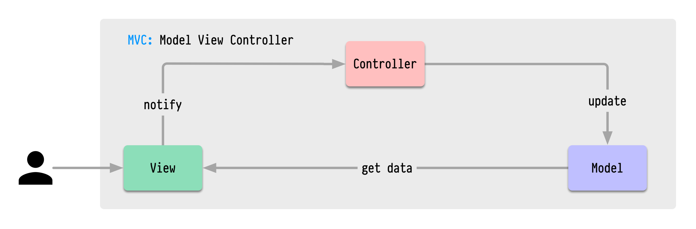
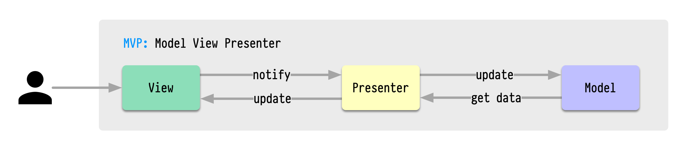
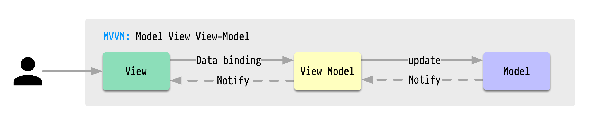
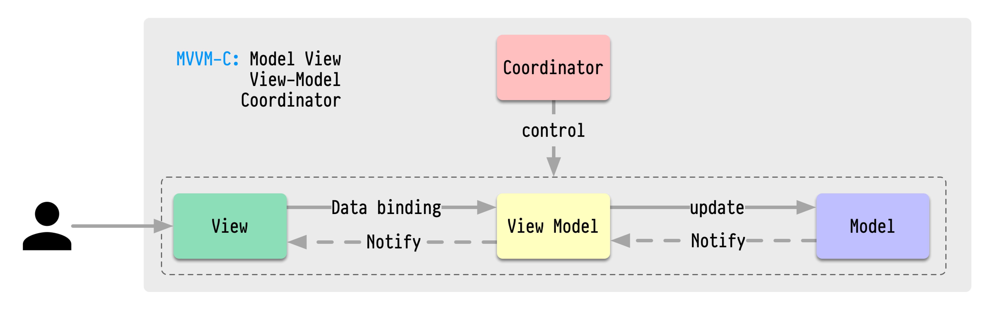
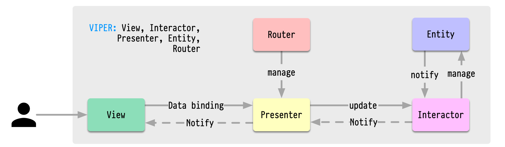

# 소프트웨어 아키텍처 디자인 패턴

## 1. MVC (Model-View-Controller)

### **구성요소**:
- Model:
    - 애플리케이션의 데이터와 비즈니스 로직을 포함
    - 데이터의 상태 변경을 View나 Controller에 통지
    - 데이터 유효성 검증 담당
- View:
    - Model의 데이터를 시각적으로 표현
    - 사용자의 입력을 받아 Controller에 전달
    - Model의 상태 변화를 주시하고 화면 갱신
- Controller:
    - View로부터 사용자 입력을 받아 처리
    - Model의 데이터를 업데이트하고 비즈니스 로직 수행 지시
    - View에게 화면 갱신을 지시

### **장점**:
- 역할이 명확하게 분리되어 코드 관리가 용이
- 동시 개발이 가능하여 개발 시간 단축
- 한 Model에 대해 여러 View를 만들 수 있음

### **단점**:
- View와 Model 사이의 의존성이 존재
- 프로젝트가 복잡해질수록 Controller가 비대해질 수 있음

## 2. MVP (Model-View-Presenter)

### **구성요소**:
- Model:
    - 데이터와 비즈니스 로직 관리
    - 데이터의 상태 변경을 Presenter에게 통지
- View:
    - UI 컴포넌트와 사용자 상호작용 담당
    - 사용자 입력을 Presenter에 위임
    - Presenter의 지시에 따라 화면 갱신
- Presenter:
    - View와 Model 사이의 중재자 역할
    - View의 이벤트에 반응하여 Model 업데이트
    - Model의 데이터를 View가 표시할 수 있는 형태로 가공

### **장점**:
- View와 Model이 완전히 분리됨
- View가 더 수동적이어서 테스트가 용이
- 인터페이스 기반 개발이 가능

### **단점**:
- View와 Presenter가 1:1 관계를 가져 코드량이 증가
- Presenter가 복잡해질 수 있음

# Controller와 Presenter의 차이점

| 항목 | Controller | Presenter |
|------|------------|-----------|
| **아키텍처 패턴** | MVC | MVP |
| **주요 역할** | - 사용자 입력 처리 - URL 라우팅 - Model 업데이트 - View 선택 | - View와 Model 간의 중재 - UI 로직 처리 - View 상태 관리 - 데이터 포맷팅 |
| **View 관계** | - View와 느슨한 결합 - 여러 View를 관리 가능 - View를 직접 업데이트하지 않음 | - View와 1:1 관계 - Interface를 통해 View 조작 - View의 상태를 직접 관리 |
| **Model 관계** | - Model을 직접 수정 - Model의 변경 사항을 View에 전파 | - Model의 데이터를 가공하여 View에 전달 - View를 통해서만 Model과 상호작용 |
| **의존성** | Controller ← View | Presenter ↔ View |
| **테스트 용이성** | - View와의 결합으로 테스트가 상대적으로 어려움 | - View 인터페이스를 통한 쉬운 테스트 - Mock 객체 사용이 용이 |
| **사용자 입력 처리** | - HTTP 요청/응답 처리 - 라우팅 규칙에 따른 처리 | - View로부터 전달받은 이벤트 처리 - UI 관련 비즈니스 로직 처리 |
| **일반적인 사용** | - 웹 애플리케이션 - 서버 사이드 로직 | - 클라이언트 애플리케이션 - 데스크톱/모바일 앱 |
| **장점** | - 구현이 단순 - 빠른 개발 가능 - 웹 개발의 표준 | - 높은 테스트 용이성 - UI 로직의 명확한 분리 - 재사용성이 높음 |
| **단점** | - 테스트가 어려움 - 비대해지기 쉬움 - View와의 결합도 | - 많은 보일러플레이트 코드 - 구조가 복잡 - 학습 곡선이 높음 |

## 3. MVVM (Model-View-ViewModel)

### **구성요소**:
- Model:
    - 애플리케이션의 데이터와 비즈니스 로직 포함
    - 데이터의 유효성 검증
    - 데이터 저장소와의 상호작용
- View:
    - UI 컴포넌트와 시각적 요소 표현
    - ViewModel과 데이터 바인딩으로 연결
    - 사용자 입력을 받아 ViewModel에 전달
- ViewModel:
    - View를 위한 데이터와 커맨드 제공
    - Model의 데이터를 View에 맞게 변환
    - View의 상태와 행위를 관리

### **장점**:
- 데이터 바인딩으로 인한 코드 감소
- View와 Model의 완전한 분리
- 단위 테스트가 매우 용이
- UI 개발자와 로직 개발자의 작업 분리 용이

### **단점**:
- 데이터 바인딩으로 인한 디버깅의 어려움
- 간단한 UI에도 ViewModel을 작성해야 하는 오버헤드

## 4. MVVM-C (MVVM + Coordinator)

- **기존 MVVM에 추가되는 구성요소**:
- Coordinator:
    - 화면 전환 로직을 중앙 집중적으로 관리
    - ViewModel 간의 통신 조정
    - 앱의 네비게이션 플로우 제어

### **장점**:
  - 화면 전환 로직이 분리되어 재사용성 증가
  - 앱의 플로우를 한 곳에서 관리 가능
  - ViewModel이 네비게이션에 대해 알 필요가 없음

### **단점**:
  - 새로운 레이어가 추가되어 복잡도 증가
  - 작은 앱에서는 과도한 구조가 될 수 있음

## 5. VIPER (View-Interactor-Presenter-Entity-Router)

### **구성요소**:
- View:
    - UI 컴포넌트와 사용자 입력 처리
    - Presenter에게 사용자 액션 전달
    - Presenter로부터 받은 데이터로 화면 갱신
- Interactor:
    - 비즈니스 로직 수행
    - Entity 객체를 조작하는 메서드 포함
    - API 호출, 데이터베이스 작업 등 처리
- Presenter:
    - View와 Interactor 사이의 중재자
    - UI 로직 처리
    - Router를 통한 화면 전환 요청
- Entity:
    - 핵심 비즈니스 모델과 데이터 구조
    - 데이터의 기본적인 조작 방법 정의
- Router:
    - 화면 전환 로직 처리
    - 화면 간의 데이터 전달 관리
    - 의존성 주입 담당

### **장점**:
  - 철저한 관심사 분리로 유지보수성 향상
  - 각 컴포넌트가 독립적이어서 테스트가 용이
  - 대규모 프로젝트에 적합한 구조
  - 팀 단위 개발이 용이  
  
### **단점**:
  - 많은 수의 프로토콜과 클래스 필요
  - 작은 기능에도 많은 보일러플레이트 코드 필요
  - 학습 곡선이 가파름
  - 오버엔지니어링이 될 수 있음
