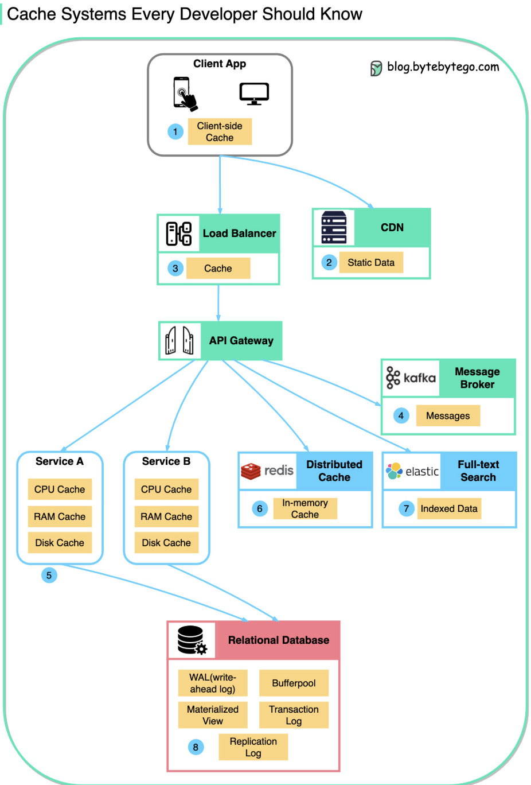

# Data is cached everywhere
### 캐시란?
- 잠시 저장해둔다는 의미!
- 자주 사용하는 데이터나 값을 미리 복사해 놓는 임시 장소

### 캐시를 사용하기 좋은 경우
- 접근 시간에 비히 원래 데이터를 접근하는 시간이 오래 걸리는 경우(서버의 균일한 API 데이터)
- 반복적으로 동일한 결과를 돌려주는 경우(이미지나 썸네일 등)

 

---

- 아래 그림은 각각의 캐시 시스템이 어떻게 서로 연결되고, 접근 속도를 향상시키는지 표현하고 있습니다. 

 

1. 클라이언트 캐시(Client-side Cache)

    - 사용자의 어플리케이션(모바일 앱 또는 웹 앱)에서 데이터를 캐싱하여 로컬에서 빠르게 접근할 수 있도록 합니다.

2. CDN(Content Delivery Network)

    - 정적 데이터를 캐싱하여 전 세계적으로 분산된 서버에서 사용자에게 빠르게 데이터를 제공하도록 돕습니다.

3. 로드 밸런서 캐시(Load Balancer Cache)

    - 로드 밸런서에서 캐싱하여 서버 요청 부하를 줄이고 빠른 응답을 제공합니다.

4. 메시지 브로커(Message Broker)

    - Kafka와 같은 시스템이 메시지를 캐싱하거나 전달하며, 비동기 처리를 지원합니다.

5. 서비스 내부 캐시(CPU, RAM, Disk Cache)

    - 개별 서비스 내에서 CPU 캐시, RAM 캐시, 디스크 캐시를 활용하여 데이터 접근 시간을 단축합니다.

6. 분산 캐시(Distributed Cache)

    - Redis와 같은 인메모리 캐시 시스템을 사용하여 여러 서비스 간에 데이터를 공유하고 빠르게 액세스합니다.

7. 전체 텍스트 검색 캐시(Full-text Search)

    - Elasticsearch와 같은 시스템에서 인덱싱된 데이터를 캐싱하여 효율적인 검색을 지원합니다.

8. 관계형 데이터베이스(Relational Database)

    - 데이터베이스 내에서 WAL(Write-ahead Log), Materialized View, 버퍼풀(Bufferpool) 등 다양한 캐시 메커니즘을 활용하여 성능을 개선합니다.