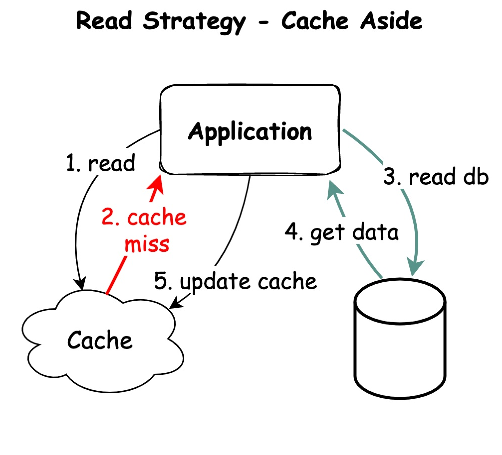
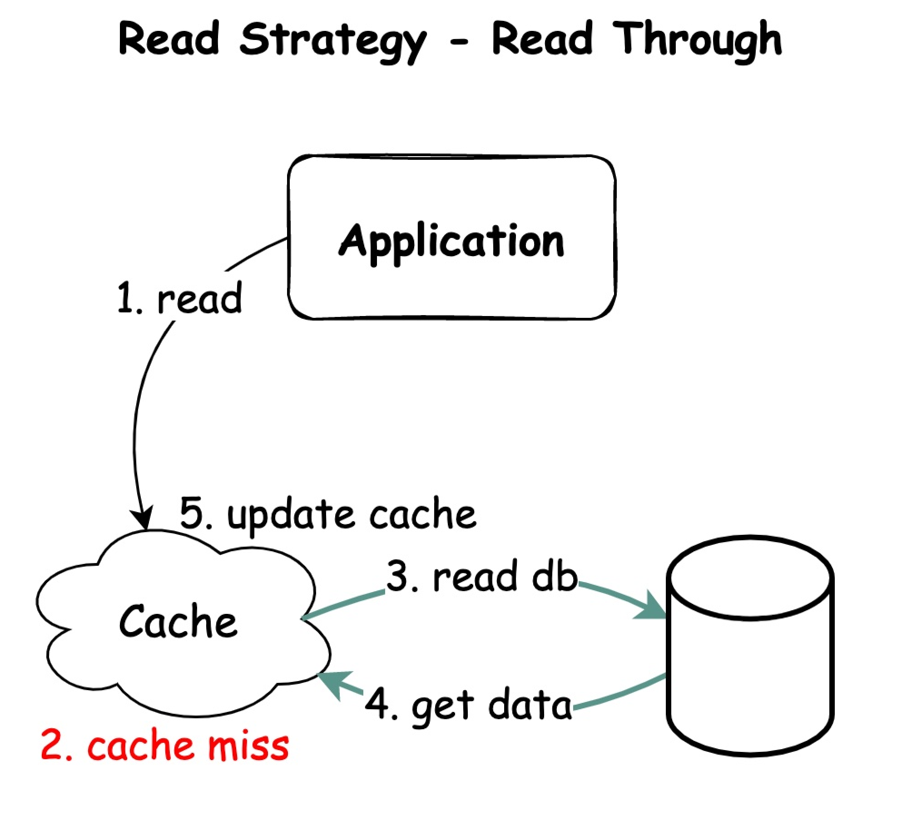
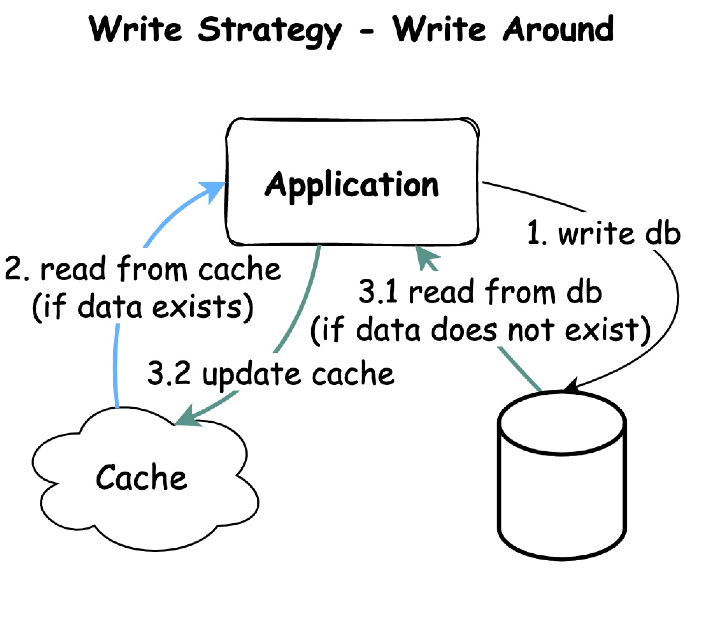
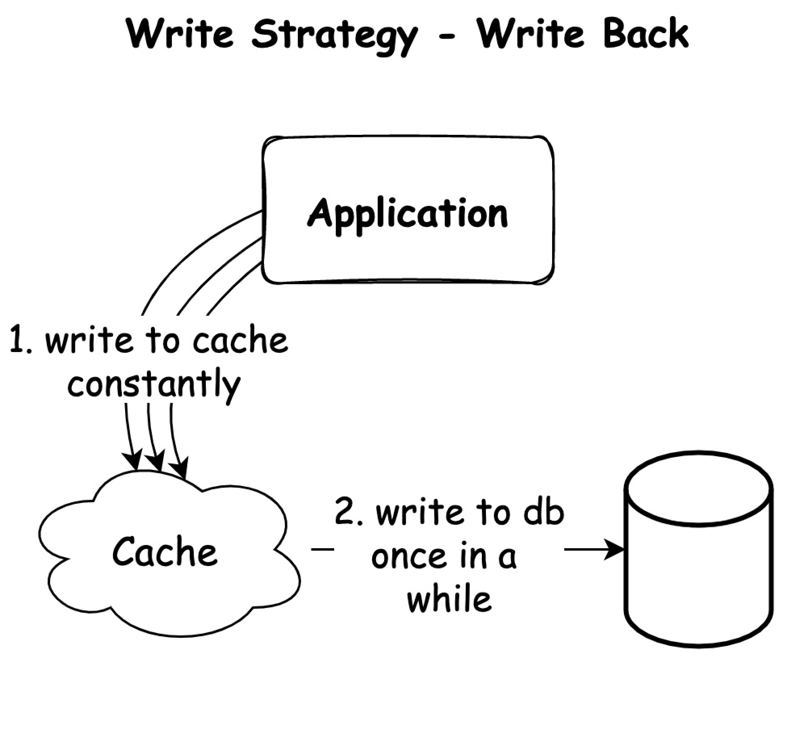
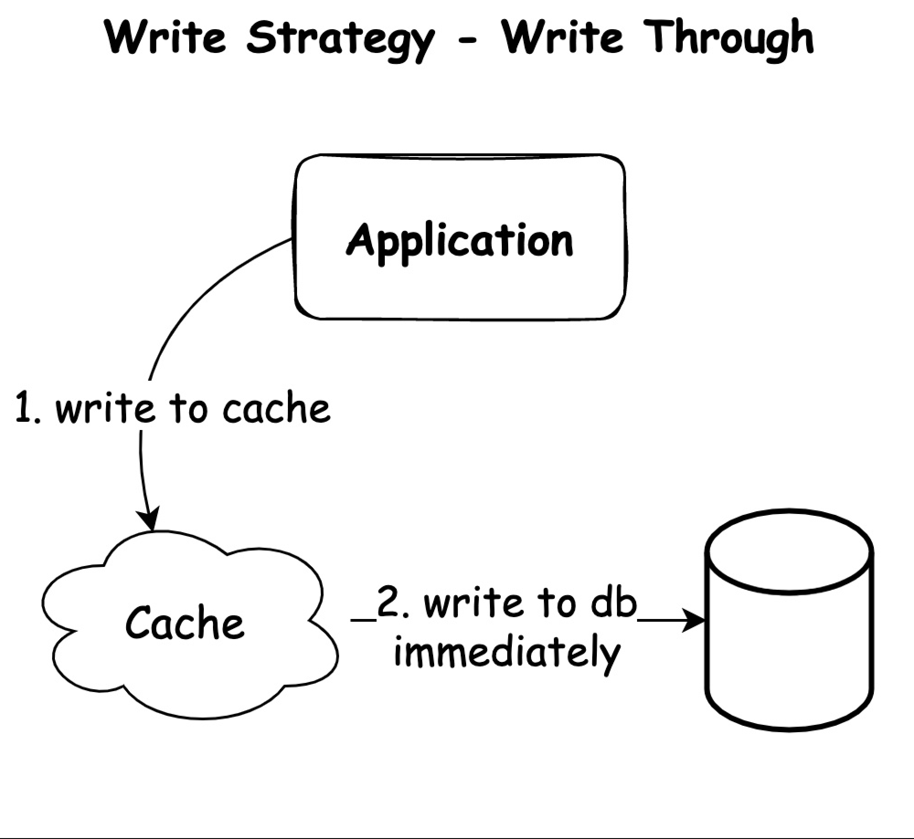

# 캐싱 전략!

## 1. 읽기(Read) 전략 상세 분석

### 1.1 Cache Aside (Lazy Loading)

- **개념**: 애플리케이션이 직접 캐시와 DB를 제어하는 가장 일반적인 전략
- **상세 프로세스**:
    1. 애플리케이션이 캐시에 데이터 조회 요청
    2. 캐시 미스 발생 시 애플리케이션이 인지
    3. 애플리케이션이 직접 DB에 쿼리 실행
    4. DB로부터 받은 데이터를 애플리케이션이 캐시에 저장
    5. 최종적으로 데이터를 사용자에게 반환
- **장점**:
    - 자주 사용되는 데이터만 캐시에 저장되어 메모리 효율적
    - 캐시와 DB가 독립적으로 운영되어 유연성 높음
- **단점**:
    - 최초 캐시 미스 시 지연 시간 발생
    - 데이터 동기화에 대한 책임이 애플리케이션에 있음

### 1.2 Read Through

- **개념**: 캐시 계층이 DB와의 통신을 담당하는 전략
- **상세 프로세스**:
    1. 애플리케이션이 캐시 계층에 데이터 요청
    2. 캐시 미스 발생 시 캐시 계층이 자동으로 DB 조회
    3. 캐시 계층이 DB로부터 데이터를 받아 저장
    4. 캐시된 데이터를 애플리케이션에 반환
- **장점**:
    - 애플리케이션 코드가 단순해짐
    - 데이터 액세스 패턴 일관성 유지
- **단점**:
    - 최초 요청 시 지연 시간 존재
    - 캐시 계층 구현의 복잡성 증가

## 2. 쓰기(Write) 전략 상세 분석

### 2.1 Write Around

- **개념**: 모든 쓰기 작업은 DB에 직접 수행하고, 캐시는 읽기 시에만 업데이트
- **상세 프로세스**:
    1. 데이터 쓰기 요청 시 DB에 직접 기록
    2. 추후 데이터 읽기 요청 시:
        - 캐시에 데이터 존재하면 캐시에서 반환
        - 캐시 미스 시 DB에서 읽어와 캐시 업데이트
- **장점**:
    - 캐시 리소스를 효율적으로 사용
    - 일회성 데이터에 최적화
    - 캐시 오버헤드 감소
- **단점**:
    - 캐시된 데이터가 최신 상태가 아닐 수 있음
    - 읽기 시 캐시 미스가 자주 발생할 수 있음

### 2.2 Write Back (Write Behind)

- **개념**: 모든 쓰기를 먼저 캐시에 수행하고, 일정 주기로 DB에 기록
- **상세 프로세스**:
    1. 데이터 변경을 캐시에 즉시 반영
    2. 주기적으로 또는 특정 조건에서 캐시의 데이터를 DB에 기록
- **장점**:
    - 쓰기 작업의 지연 시간 최소화
    - 많은 양의 쓰기 작업을 배치로 처리 가능
    - DB 부하 감소
- **단점**:
    - 캐시 장애 시 데이터 유실 위험
    - 데이터 정합성 보장이 어려움
    - 구현 복잡도가 높음

### 2.3 Write Through

- **개념**: 모든 쓰기 작업을 캐시와 DB에 동시에 수행
- **상세 프로세스**:
    1. 데이터 쓰기 요청 발생
    2. 캐시에 데이터 쓰기
    3. 동시에 DB에도 데이터 쓰기
- **장점**:
    - 데이터 일관성 보장
    - 데이터 유실 위험 최소화
    - 읽기 작업의 지연 시간 일관적
- **단점**:
    - 쓰기 작업의 지연 시간 증가
    - 리소스 사용량 증가


## 3. 상황별 최적의 캐싱 전략 추천

### 3.1 읽기 위주의 워크로드 (Read-heavy)
- **추천 전략**: ```Cache Aside``` + ```Write Through```
- **적용 시나리오**:
- 소셜 미디어 피드
- 상품 카탈로그
- 뉴스 포털
- **선택 이유**:
- 읽기 성능 최적화
- 데이터 일관성 보장
- 캐시 미스 최소화

### 3.2 쓰기 위주의 워크로드 (Write-heavy)
- **추천 전략**: ```Write Back```
- **적용 시나리오**:
- 로그 수집 시스템
- IoT 데이터 수집
- 실시간 분석 시스템
- **선택 이유**:
- 높은 쓰기 처리량
- DB 부하 분산
- 배치 처리를 통한 효율성

### 3.3 실시간 데이터 처리 (Real-time)
- **추천 전략**: ```Write Through``` + ```Read Through```
- **적용 시나리오**:
- 금융 거래 시스템
- 실시간 재고 관리
- 게임 서버
- **선택 이유**:
- 강력한 데이터 일관성
- 실시간 데이터 정확성
- 안정적인 시스템 운영

### 3.4 대용량 데이터 처리
- **추천 전략**: ```Write Around``` + ```Cache Aside```
- **적용 시나리오**:
- 빅데이터 분석 시스템
- 미디어 스트리밍 서비스
- 대용량 파일 처리
- **선택 이유**:
- 효율적인 리소스 사용
- 선택적 캐싱으로 메모리 최적화
- 처리 지연 최소화

### 3.5 높은 가용성이 필요한 시스템
- **추천 전략**: ```Read Through``` + ```Write Through```
- **적용 시나리오**:
- 전자상거래 플랫폼
- 핵심 비즈니스 서비스
- 사용자 인증 시스템
- **선택 이유**:
- 안정적인 데이터 처리
- 장애 상황 대비
- 데이터 손실 방지