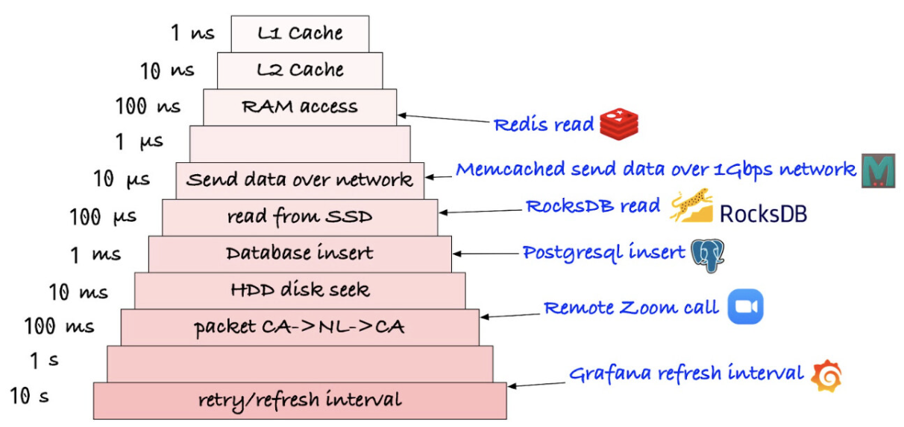
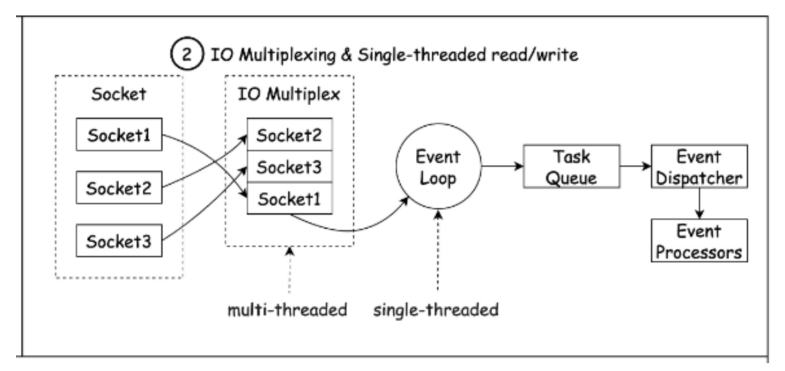
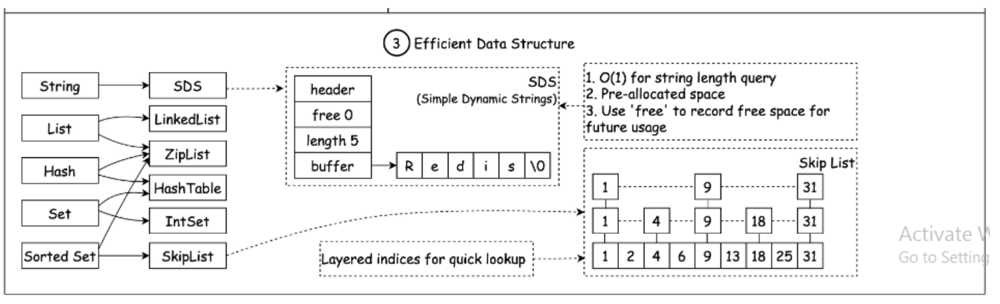

# Why is Redis so fast?

### Redis란?
- Remote Dictionary Server의 약자
- “key - value”데이터 구조에 기반한 비정형 데이터를 저장,관리
- 오픈소스 기반의 비관계형(NoSQL) 데이터베이스 관리 시스템 (DBMS)

### Redis의 가장 큰 특징
- 인메모리 (in-memory)에 모든 데이터를 저장한다 -> 데이터 처리 성능이 굉장히 빠름
 

RDBMS의 데이터베이스는 대부분 디스크(Disk)에 데이터를 저장하지만, 
Redis는 메모리(RAM)에 데이터를 저장합니다.

디스크보다 메모리에서의 데이터 처리속도가 월등하게 빠르기 때문에 Redis의 데이터 처리속도가 RDBMS에 비해 훨씬 빠른것 입니다.

 

## Redis가 빠른 이유 3가지
#### 1. Redis는 RAM 기반 데이터 저장소입니다. RAM 액세스는 랜덤 디스크 액세스보다 최소 1000배 빠릅니다. 

 

- 높은 처리량과 낮은 지연시간이 장점이지만 메모리 크기를 넘는 데이터를 저장할 수 없습니다.

#### 2. Redis는 실행 효율성을 위해 IO 멀티플렉싱과 싱글 스레드 실행 루프를 활용합니다. 

 

- 멀티 쓰레드는 Lock과 동기화 등이 필요하지만 싱글 쓰레드는 그렇지 않아서 속도에 이점이 있습니다.
- I/O 멀티플렉싱을 통해 싱글 쓰레드에 시스템 콜을 하여 여러개의 요청을 처리하도록 합니다.

    * I/O 멀티플렉싱이란? 
        하나의 스레드에서 다수의 클라이언트에 연결된 소켓을 관리하면서 소켓이벤트(read/write)가 발생할 때만 해당 이벤트를 처리하도록 구현한 것! 
        멀티프로세싱, 멀티쓰레딩 방식보다 더 적은 리소스를 사용합니다.

#### 3. Redis는 여러 가지 효율적인 하위 수준 데이터 구조를 활용합니다. 

 

- 효율적인 Low-Level 데이터 구조를 사용하는데, 
이는 Disk에 어떻게 효율적으로 데이터를 저장할지 고려하지않기 때문에 빠른 데이터 저장 및 검색을 제공합니다.
