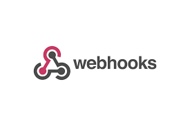

# REST vs GraphQL vs RPC vs SOAP

**현존하는 API Protocol 의 종류** <br> 
- REST, WebHooks, GraphQL, SOAP, WebSocket, gRPC
- ~~MQTT, AMQP, SSE, EDI, EDA~~

<hr>

# GraphQL? (==gql)

클라이언트에서 서버의 데이터를 효율적으로 가져오기 위한 클라이언트에서 서버의 데이터를 효율적으로 가져오기 위한 언어. <br>
=> 오픈소스로 15년도에 Meta에서 출시 후 23년 기준 채택률이 **29%** 까지 올라감!

> gql도 결국엔 SQL(Structure Query Language)이다! <br>
> - SQL : DB의 데이터를 가져오기 위한 언어  <br>
> - GQL : 웹 클라이언트가 서버 정보를 가져오기 위한 언어


**GQL 작동 순서 및 예시 코드**

- **스키마 정의**: 서버에서 데이터 모델과 엔드포인트를 정의한 스키마를 작성
  <br> => 스키마에는 데이터 유형, 필드, 쿼리, 뮤테이션 등이 포함  
  <br>
- **쿼리 작성**: 클라이언트는 원하는 데이터 구조에 맞춰 쿼리를 작성
  <br> => 쿼리는 JSON과 유사한 형식으로 작성
  <br>
  <br>
- **요청 및 응답**: 클라이언트가 GraphQL 서버로 쿼리를 전송하면, 서버는 요청을 처리한 후 클라이언트가 요청한 데이터만 반환

```JavaScript
// GQL 요청 예시
{
    user(id: 1) { // 사전에 미리 정의한 스키마 (user)
    // 필요한 스키마의 각 컬럼들을 작성해 요청
    name
    email
    posts { // 사전에 미리 정의한 스키마 (posts)
        title
        content
    }
}
}

// GQL 응답 예시
{
    "data": {
    "user": {
        "name": "John Doe",
            "email": "john.doe@example.com",
            "posts": [
            {
                "title": "GraphQL Basics",
                "content": "Introduction to GraphQL..."
            }
        ]
    }
}
}
```


## GraphQL pipeLine


## REST vs GraphQL


<hr>


# GraphQL의 장점
## 1. 하나의 엔드포인트로 통일


- 유연한 데이터 요청
- 오버페칭(Over-fetching) 및 언더페칭(Under-fetching)의 해결
- Endpoint를 그대로 사용하면서 컬럼만 추가/삭제가 가능하기 때문에 버전 관리가 불필요
 

> - 오버페칭: REST 엔드포인트가 필요 이상으로 많은 데이터를 반환하는 경우.
> - 언더페칭: 필요한 데이터를 얻기 위해 여러 번의 요청이 필요한 경우.

> **REST와의 차이점!**  
> ```/player``` ```/teams``` 두 정보를 가져오는 API에서 ```/matches``` 정보를 추가로 가져오고 싶을 경우!  
>  - REST : ```/player``` ```/teams``` ```/matches``` 정보를 반환하는 endpoint 추가 혹은 클라이언트에서 2번 요청하여 구현  
> - GraphQL : 같은 endpoint를 사용하여 쿼리문 내부에 컬럼을 추가하여 데이터를 호출 가능!
 

### <비교 코드>
```javascript
// Client
const server = new ApolloServer({
  typeDefs,
  resolvers,
  // 엔드포인트가 아닌 컬럼 내부 값을 변경하여 user, post 정보를 모두 호출
  dataSources: () => ({ 
    userAPI: new UserAPI(),
    postAPI: new PostAPI(),
  }),
});
```

```javascript
// Server
class UserAPI {
  async getUserById(id) {
    // DB에서 사용자 정보 조회
    return {
      id,
      name: "John Doe",
      email: "john@example.com",
    };
  }
}

class PostAPI {
  async getPostsByUserId(userId) {
    // DB에서 사용자 게시글 조회
    return [
      { id: 1, title: "First Post", content: "Hello World!" },
      { id: 2, title: "Second Post", content: "GraphQL is awesome!" },
    ];
  }
}

module.exports = { UserAPI, PostAPI };
```


## 2. 강력한 스키마

REST는 명시적인 스키마가 없으며, 문서화를 통해 API 구조를 설명해 이는 종종 유지보수와 테스트를 어렵게 만듦.

GraphQL은 스키마를 통해 데이터 구조를 명확히 정의   
=> API의 예측 가능성을 높이고, 도구(예: GraphiQL, Apollo Studio)를 통해 실시간으로 탐색하고 테스트할 수 있게 함.  
=> 필드 단위로 스키마를 작성하고, 리졸버에서는 이 스키마를 가져다 사용하기 때문에 DTO같은 객체 단위로 사용하는 기존 REST에 비해 유연한 데이터 관리가 가능하다.

```
// GraphQL 스키마 작성 예시
# GraphQL 스키마 정의
"""
사용자 정보를 나타내는 타입
"""
type User {
  """
  사용자의 고유 식별자
  """
  id: ID!
  
  """
  사용자의 이름
  """
  name: String!
  
  """
  사용자의 이메일
  """
  email: String!
  
  """
  사용자의 나이
  """
  age: Int
  
  """
  사용자의 역할
  """
  role: UserRole!
}

"""
사용자 역할을 나타내는 enum
"""
enum UserRole {
  ADMIN
  USER
  GUEST
}

"""
사용자 생성 시 필요한 입력 타입
"""
input CreateUserInput {
  name: String!
  email: String!
  age: Int
  role: UserRole!
}

type Mutation {
  """
  새로운 사용자를 생성합니다.
  """
  createUser(input: CreateUserInput!): User!
}
```

## 3. 구독을 통한 실시간 업데이트

REST는 기본적으로 실시간 데이터를 제공하지 않으며, 이를 구현하려면 WebSocket이나 다른 기술이 필요함.

 
GraphQL은 **서브스크립션(Subscriptions)** 을 통해 실시간 데이터를 제공할 수 있음. 이를 통해 클라이언트는 서버의 데이터 변화에 즉시 반응할 수 있음.
  

<hr>


## GraphQL의 장점 요약

- 단일 엔드포인트: 모든 데이터를 한 곳에서 관리.

- 필요한 데이터만 요청: 클라이언트가 원하는 데이터만 반환.

- 스키마 기반: 데이터 구조가 명확하고 예측 가능.

- 버전 관리 불필요: 기존 클라이언트와의 호환성을 유지하면서 점진적으로 개선 가능.

- 실시간 데이터: 서브스크립션을 통한 실시간 데이터 업데이트.

- 도구 지원: GraphiQL, Apollo, Relay 등 강력한 도구 생태계.


<hr>

## REST (Representational State Transfer)
*가장 널리 사용되는 API 아키텍처로서의 입지*


### 주요 특징
현재 API 설계에서 가장 보편적으로 활용되는 아키텍처임. 최근 사용 비율이 다소 감소했으나, 단순성과 확장성, 웹 서비스와의 용이한 통합성으로 인해 여전히 높은 인기를 유지하고 있음.

### 장점
- HTTP 프로토콜 기반의 단순하고 표준화된 구조로 빠른 학습과 통합이 가능함
- 상태 비저장(Stateless) 특성으로 인한 우수한 확장성과 서버 부하 감소 효과
- 캐시 활용과 상태 비저장 방식을 통한 성능 최적화 실현
- 독립적 개발 및 업데이트가 가능한 모듈성으로 유지보수 용이성 확보
- 다양한 클라이언트 플랫폼 지원과 풍부한 개발 생태계 보유

### 단점
- 데이터의 오버-페칭/언더-페칭 문제 발생 가능
- 연관 데이터 조회 시 다중 요청으로 인한 성능 저하 우려
- 데이터 구조 변경 시 버전 관리의 복잡성 증가
- 요청마다 컨텍스트 포함으로 인한 불필요한 데이터 전송 발생
- 실시간 데이터 처리에 대한 제한적 지원
<hr>

## WebHooks
*이벤트 기반 실시간 통신의 구현*

!

### 주요 특징
특정 이벤트 발생 시 HTTP 요청을 통한 실시간 통신을 지원하며, 시스템 간 효율적 통합을 가능하게 함.

### 장점
- 이벤트 발생 즉시 데이터 전송으로 실시간성 보장
- 폴링 방식 제거를 통한 리소스 효율성 향상
- 사용자 정의 가능한 이벤트 기반 데이터 전송
- HTTP 프로토콜 기반의 간편한 구성
- 이벤트 기반 설계를 통한 모듈성 강화

### 단점
- 수신 시스템 오류로 인한 데이터 손실 위험
- 보안 취약성에 대한 추가적인 보호 조치 필요
- 다수의 WebHook 관리 및 모니터링의 복잡성
- 동시 다발적 콜백으로 인한 리소스 부하 가능성
<hr>

## SOAP (Simple Object Access Protocol)
*엔터프라이즈급 보안과 신뢰성 제공*


### 주요 특징
XML 기반의 메시지 교환 프로토콜로서, 높은 수준의 보안성과 트랜잭션 지원이 특징임.

### 장점
- WSDL을 통한 엄격한 타입 계약으로 신뢰성 확보
- WS-Security를 활용한 고급 보안 기능 내장
- 완전한 ACID 트랜잭션 지원으로 데이터 무결성 보장
- 안정적인 메시지 전달과 오류 처리 체계
- XML 기반의 플랫폼 독립적 운용

### 단점
- XML 사용으로 인한 구현의 복잡성
- REST 대비 큰 페이로드 크기로 인한 성능 영향
- 감소하는 커뮤니티 지원과 개발 리소스
- 변경사항 적용 시 양측 동시 업데이트 필요
- 네트워크 환경에 따른 제약사항 존재
<hr>

## WebSocket
*실시간 양방향 통신의 구현*


### 주요 특징
지속적인 양방향 연결을 통해 실시간 데이터 전송을 지원하며, 특히 실시간 애플리케이션에 적합함.

### 장점
- 낮은 지연시간의 양방향 실시간 통신 지원
- 최소화된 통신 오버헤드
- 효율적인 서버 리소스 활용

### 단점
- 구현과 유지보수의 기술적 복잡성
- 부가 기능의 직접 구현 필요성
- 대규모 연결 시 자원 소비 증가
- 특정 네트워크 환경에서의 제약
<hr>

## gRPC
*고성능 마이크로서비스 통신*


### 주요 특징
Google이 개발한 고성능 RPC 프레임워크로, HTTP/2와 프로토콜 버퍼 기반의 효율적 통신을 제공함.

### 장점
- HTTP/2 활용한 고성능 데이터 처리
- 컴파일 타임 타입 검증으로 안정성 향상
- 광범위한 프로그래밍 언어 지원
- 효과적인 실시간 스트리밍 기능
- 다양한 내장 기능 제공

### 단점
- 웹 브라우저 지원의 제한성
- 상대적으로 높은 진입 장벽
- 복잡한 디버깅 프로세스

<hr>


<br><br>

Ref.
- 2023년 API Protocol 현황 (https://news.hada.io/topic?id=12179)
- https://medium.com/nerd-for-tech/graphql-vs-restful-e1a99fd14285
- https://simsimjae.medium.com/graphql%EA%B0%9C%EB%A1%A0-8d61b1952191
- https://tech.kakao.com/posts/364