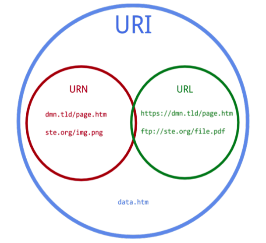

# URL, URI, URN - 차이점을 알고 계시나요?
 

 

- ## URL
    - Uniform Resource **Locator**
    - 자원의 위치를 나타냄
    - 네트워크 상에서 자원이 어디에 있는지 알려주는 주소로 사용
    - 자원의 **접근방식(프로토콜)** 과 위치를 포함한다! 
    구조 : 프로토콜://도메인/경로 
    ex)
    `
    http://example.com ,
    ftp://fileserver.com/resource.txt 
    `
    - #### 어떻게 리소스를 얻을 것이고, 어디에서 가져와야하는지 명시하는 URI

 

 

- ## URN
    - Uniform Resource **Name**
    - URL이 리소스의 위치를 나타낸다면, URN은 리소스에 이름을 부여하는것!
    - 리소스의 접근 방법과 웹 상의 위치가 표기되지 않는다.
    - 리소스 자체에 부여된 영구적이고 유일한 이름이고 변하지 않는다.
    - 실제 자원을 찾기 위해서는 URN을 URL로 변환하여 이용한다.
    - #### 어떻게 리소스에 접근할 것인지 X! 경로와 리소스 자체를 특정하는 것을 목표로 하는 URI 
        ex)
    `
    URN: urn:isbn:0451450523 (책을 식별하는 고유한 이름)
    `

        `
        URL: https://example.com/books/0451450523 (그 책을 실제로 볼 수 있는 위치)
        `

 

 

- ## URI
    - Uniform Resource **Identifier**
    - 통합 자원 식별자의 줄임말
    - 인터넷에 있는 자원을 어디에 있는지 자원 자체를 식별하는 방법
    - 프로토콜 필수!
    - URI의 하위 개념으로 URL과 URN이 있음

 

 

## 요약정리 
| **구분** | **설명**                   | **예시**                 |
|----------|----------------------------|--------------------------|
| **URI**  | 자원의 식별을 위한 총칭      | URL, URN 모두 포함       |
| **URL**  | 자원의 위치를 표현          | `http://example.com`     |
| **URN**  | 자원의 고유 이름을 표현      | `urn:isbn:0451450523`    |
