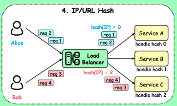

# 일반적인 로드 밸런싱 알고리즘은 무엇인가요?
이 단원에서는 일반적인 로드 밸런싱 알고리즘을 6개 설명하고 있습니다.
 

 

**정적 로드밸런싱**

- ## Round robin

    - 들어오는 트래픽을 서버 순서대로 배치하는 방식
    - 연결된 세션이 비교적 오래 사용되지 않는 경우에 활용하는것이 좋다.
        - 왜???
        
            **이 방식은서버의 실제 부하**나 **연결 세션의 지속 시간**을 고려하지 않기 때문!
        
         
 

 

- ## sticky round robin

    - 기본 Round Robin에 세션 지속성(Sticky Session) 기능을 추가한 방식 
        즉! 클라이언트가 계속 동일 서버로 연결되며, 세션 정보를 유지한다.
    - 사용자 세션이 동일한 서버에서 유지되므로 상태를 유지해야할 때 사용 
        ex)로그인 상태를 유지해야하는 쇼핑몰, 게임서버 등
    - 특정 서버만 과부화가 발생할 수 있다.
    - 특정 서버 fail 시 세션 데이터 유실
    - 특정 서버로 요청 처리를 고정시키는 방법은? 
        Cookie사용 or 클라이언트의 IP tracking
        - [참고로 AWS ELB는 cookie를 사용하여 Http Response에 cookie를 이용해서 해당 클라이언트가 가야하는 EC2 instance의 정보를 저장해두고 그걸 활용하여 특정 EC2로 요청을 고정한다.](https://aws.amazon.com/ko/blogs/aws/new-elastic-load-balancing-feature-sticky-sessions/) 

         
 

 

- ## weighted round robin

    - 각 서버마다 가중치를 매기고 가중치가 높은 서버에 클라이언트의 요청을 우선적으로 배분하는 방식 
    ex) 서버A : 가중치 5 / 서버B : 가중치 2
      ⇒ A에 5개의 request, B에 2개의 request 할당
    - 주로 서버의 트래픽 처리 능력이 상이한 경우 사용 

         

 

 

- ## IP/URL Hash

    - 클라이언트의 IP 또는 URL을 해시값으로 변환 → 해당 해시값을 기준으로 서버에 요청을 분배
    - IP Hash라면?
        - 각 클라이언트가 특정 서버에 할당 되므로 같은 IP주소라면 같은 서버로 요청 전달!
        - **경로가 보장되며, 접속자 수가 많을수록 분산 및 효율이 뛰어남** 
        → 접속자 IP가 많을수록 고르게 분포될거니까~

    - URL  Hash도 마찬가지
        - 같은 URL → 같은 서버로 요청! 

         

---
 

**동적 로드밸런싱**

- ## Least connections (최소 연결)

    - 현재 매핑되어 있는 커넥션이 가장 적은 서버로 세션을 연결해주는 방식
    - **자주 세션이 길어지거나, 서버에 분배된 트래픽들이 일정하지 않은 경우**에 적합 

         

 

 

- ## Least time ,(Least Response Time, 최소응답시간)

    - 서버의 현재 연결 상태와 응답 시간을 모두 고려하여, 가장 짧은 응답 시간을 보내는 서버로 분배
    - 각 서버의 가용 가능한 리소스와 성능, 처리 중인 데이터양 등이 상이할 경우 적합 

         
        참고…[https://smallrye.io/smallrye-stork/1.1.1/load-balancer/response-time/](https://smallrye.io/smallrye-stork/1.1.1/load-balancer/response-time/)

---
그림출처 : https://github.com/ByteByteGoHq/system-design-101/?tab=readme-ov-file#what-are-the-common-load-balancing-algorithms 
참고자료 
[https://co-no.tistory.com/entry/네트워크-로드밸런싱](https://co-no.tistory.com/entry/%EB%84%A4%ED%8A%B8%EC%9B%8C%ED%81%AC-%EB%A1%9C%EB%93%9C%EB%B0%B8%EB%9F%B0%EC%8B%B1) 
[https://www.youtube.com/watch?v=9_6COPOMZvI](https://www.youtube.com/watch?v=9_6COPOMZvI) 
[https://www.youtube.com/watch?v=kYipnodgi2I](https://www.youtube.com/watch?v=kYipnodgi2I) 