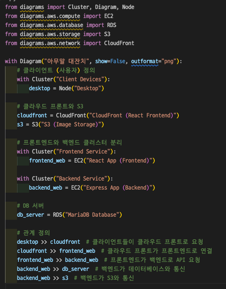
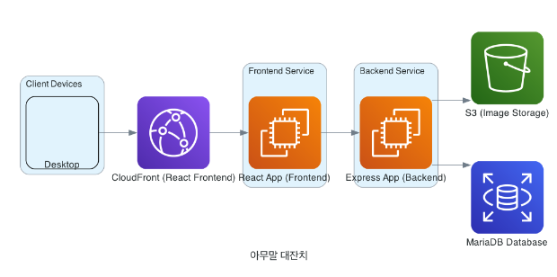

# JSON 파일 시각화
중접된 JSON파일은 읽기 어렵다! 
-> JSONCrack을 이용하면 JSON파일에서 그래프 다이어그램을 생성하여 읽기 쉽게 만들어준다

https://jsoncrack.com/editor

# 코드를 아키텍처 다이어그램으로 자동 변환

 

 

[깃 정보](https://github.com/mingrammer/diagrams)   

### Diagrams란?
- Python코드로 클라우드 시스템 아키텍쳐를 그릴 수 있게 해주는 도구
- 디자인 툴 없이도 빠르게 설계를 시각화 할 수 있다!
