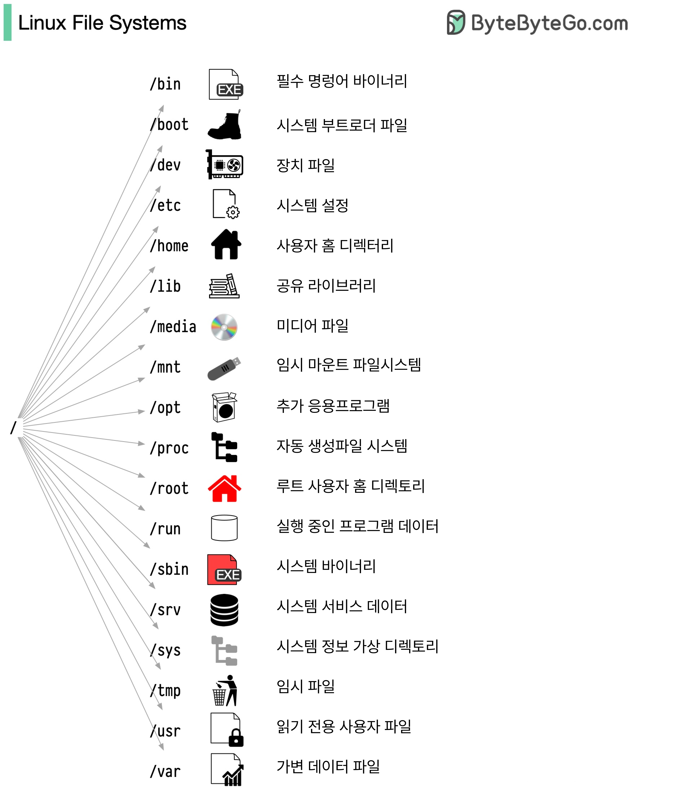

# Linux 파일 시스템 구조

### /bin (Essential command binaries) - 필수 명령어 바이너리
- 시스템의 기본적인 명령어들이 저장된 디렉토리
- ls, cp, mv 등과 같은 기본 명령어들이 위치
- 시스템 복구나 복구 모드에서도 사용 가능해야 하는 핵심 명령어들이 포함

### /boot (System boot loader files) - 시스템 부트로더 파일
- Linux 커널과 부팅에 필요한 파일들이 저장되는 위치
- GRUB 부트로더 설정 파일과 커널 이미지가 포함
- 시스템 시작 시 가장 먼저 참조되는 중요한 디렉토리

### /dev (Device files) - 장치 파일
- 하드웨어 장치들을 파일 형태로 관리하는 디렉토리
- 하드디스크(/dev/sda), CD-ROM(/dev/cdrom) 등의 장치 파일이 위치
- 시스템에 연결된 모든 장치들이 파일 형태로 표현됨

### /etc (Host-specific system-wide configuration files) - 시스템 설정 파일
- 시스템 전반의 설정 파일들이 저장되는 디렉토리
- 네트워크 설정, 사용자 계정 정보, 시스템 서비스 설정 등이 포함
- 관리자가 시스템을 설정하는 데 필요한 거의 모든 설정 파일이 위치

### /home (User home directory) - 사용자 홈 디렉토리
- 일반 사용자들의 개인 디렉토리가 위치
- 각 사용자의 개인 파일, 설정 파일들이 저장됨
- 사용자별로 독립된 작업 공간을 제공

### /lib (Shared library modules) - 공유 라이브러리
- 시스템과 응용프로그램에서 사용하는 공유 라이브러리 파일들이 저장
- 커널 모듈과 기본 프로그램 실행에 필요한 라이브러리 포함
- /bin과 /sbin의 프로그램들이 사용하는 라이브러리들이 위치

### /media (Media files) - 미디어 파일
- CD-ROM, USB 등과 같은 이동식 미디어의 마운트 포인트
- 자동으로 인식되는 장치들이 마운트되는 위치
- 현대 리눅스 시스템에서는 자동 마운트를 위해 주로 사용

### /mnt (Temporary mounted filesystems) - 임시 마운트 파일시스템
- 임시로 파일시스템을 마운트하기 위한 디렉토리
- 시스템 관리자가 수동으로 마운트할 때 사용
- 네트워크 파일시스템이나 임시 마운트가 필요한 경우 사용

### /opt (Add-on application software packages) - 추가 응용프로그램
- 추가적인 소프트웨어 패키지가 설치되는 디렉토리
- 패키지 형태로 배포되는 상용 소프트웨어들이 주로 설치됨
- 기본 시스템 외의 추가 응용프로그램을 관리하기 위한 공간

### /proc (Automatically generated file system) - 자동 생성 파일시스템
- 현재 실행 중인 프로세스와 커널 정보를 포함하는 가상 파일시스템
- 시스템 정보를 실시간으로 확인할 수 있는 인터페이스 제공
- 메모리 사용량, CPU 정보 등 시스템 상태 정보를 파일 형태로 제공

### /root (Home directory for root user) - 루트 사용자 홈 디렉토리
- 시스템 관리자(root) 계정의 홈 디렉토리
- 시스템 관리에 필요한 중요 파일들이 저장됨
- 일반 사용자와 구분된 별도의 관리자 작업 공간

### /run (Run-time program data) - 실행 중인 프로그램 데이터
- 시스템이 시작된 이후의 실행 중인 프로그램 정보
- 프로세스 ID(PID) 파일과 같은 실행 시 필요한 데이터 저장
- 시스템이 재시작되면 초기화되는 임시 데이터 저장소

### /sbin (System binaries) - 시스템 바이너리
- 시스템 관리에 필요한 중요 실행 파일들이 위치
- fdisk, fsck 등 시스템 관리 도구들이 포함
- 주로 root 사용자가 사용하는 시스템 관리 명령어들이 저장

### /srv (Site-specific data served by this system) - 시스템 서비스 데이터
- 시스템에서 제공하는 서비스의 데이터가 저장되는 위치
- 웹 서버, FTP 서버 등의 서비스 데이터가 저장됨
- 서비스별로 구분된 데이터 저장소 제공

### /sys (Virtual directory providing information about the system) - 시스템 정보 가상 디렉토리
- 시스템 하드웨어 정보를 제공하는 가상 파일시스템
- 장치 드라이버와 커널 기능을 설정할 수 있는 인터페이스 제공
- 하드웨어 정보를 실시간으로 확인하고 제어할 수 있는 기능 제공

### /tmp (Temporary files) - 임시 파일
- 시스템과 사용자가 임시로 사용하는 파일들이 저장되는 공간
- 시스템 재시작 시 자동으로 삭제됨
- 모든 사용자가 읽고 쓸 수 있는 공용 임시 저장소

### /usr (Read-only user files) - 읽기 전용 사용자 파일
- 시스템 운영에 필요한 읽기 전용 데이터가 저장됨
- 응용프로그램, 라이브러리, 문서 등이 포함
- 여러 시스템이 공유할 수 있는 데이터가 저장되는 공간

### /var (File that is expected to continuously change) - 가변 데이터 파일
- 시스템 운영 중 지속적으로 변경되는 데이터가 저장되는 공간
- 로그 파일, 메일 스풀, 프린트 스풀 등이 저장됨
- 시스템 운영 중 크기가 변경되는 파일들을 관리하는 공간