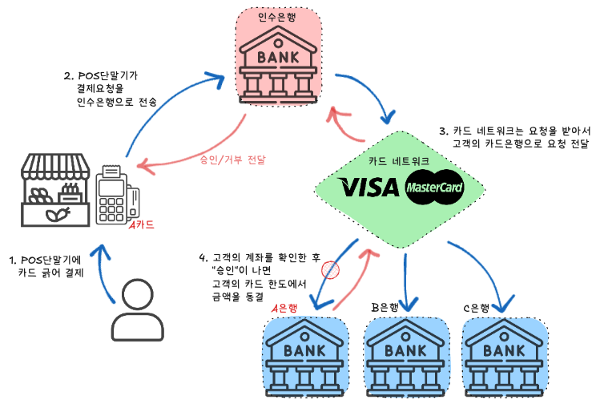
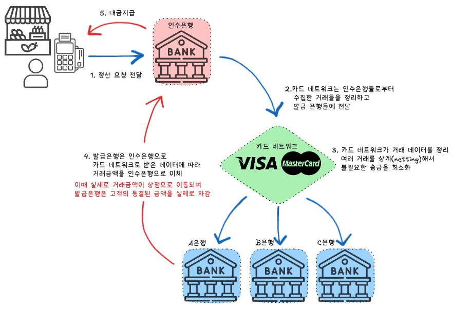

# 신용카드로 결제할 때 VISA 카드는 어떻게 작동하나요?
VISA, Mastercard, American Express와 같은 카드 네트워크는 결제 승인을 처리하고, 자금을 정산하는 역할을 합니다. 
카드 결제 프로세스에는 두 가지 주요 흐름이 있습니다.

## 1. 승인프로세스 (Authorization Flow)
고객이 카드로 결제할 때 실시간으로 거래 승인을 받는 과정

 

Step 1: 고객이 매장에서 물건을 구매하려고 POS 단말기에서 카드를 긁습니다. 
Step 2: POS 단말기는 해당 거래 정보를 카드 결제 대행사(인수은행)에 보냅니다. 
Step 3: 인수은행은 거래를 카드 네트워크(VISA, Mastercard 등)에 전송합니다. 
Step 4: 카드 네트워크는 거래를 카드 발급 은행에 전달하여 승인을 요청합니다. 
Step 5: 승인 또는 거부를 다시 상점으로 전달합니다. 
### 결제가 완료된 것처럼 보이지만, 아직 돈은 상점으로 가지않았습니다.
 

 

## 2. 정산 및 대금 지급 프로세스 (Capture and Settlement Flow)
하루 거래가 마무리된 후, 상점이 대금을 수령하는 과정

 

Step 1: 상점은 하루 거래가 끝난 뒤 POS 단말기에서 "정산(capture)"을 수행하며 거래 정보가 인수은행에 일괄 전송됩니다. 
Step 2: 카드 네트워크는 인수은행들로부터 수집한 거래들을 정리하고, 이를 발급 은행들에 전달합니다. 
Step 3: 카드 네트워크는 여러 가게, 여러 은행에서 발생한 거래를 모아서 정리합니다.  
    이 과정에서 서로의 거래 금액을 상계(서로 주고받을 금액을 계산)합니다. 
- 예) 
    A은행 → B은행: 100만 원 거래 
    B은행 → A은행: 50만 원 거래 
    => 결과적으로 A은행이 B은행에 50만 원만 보내면 됩니다. 

Step 4: 발급 은행은 정산 파일의 정확성을 확인한 후, 인수은행에 대금을 이체합니다. 
Step 5: 인수은행은 상점의 은행 계좌로 대금을 지급합니다. 

 

 

---

 

<h2> cf)</h2>

### 왜 하루 거래를 모아서 정산하나요?
- 개별 거래마다 정산하면 비용이 증가하고 시간이 오래 걸리기 때문에, 하루 동안의 거래를 모아 한꺼번에 처리
- 모든 거래를 한 번에 정리하면 불필요한 송금 횟수를 줄이고, 은행 간 정산이 더 쉬워지기 때문

### 고객이 결제를 취소한다면?
- 고객이 결제를 취소하면, 발급은행에서 고객 계좌로 돈을 다시 돌려줍니다.
- 이 과정에서도 카드 네트워크와 인수은행, 발급은행 간의 데이터 교환이 이루어집니다.