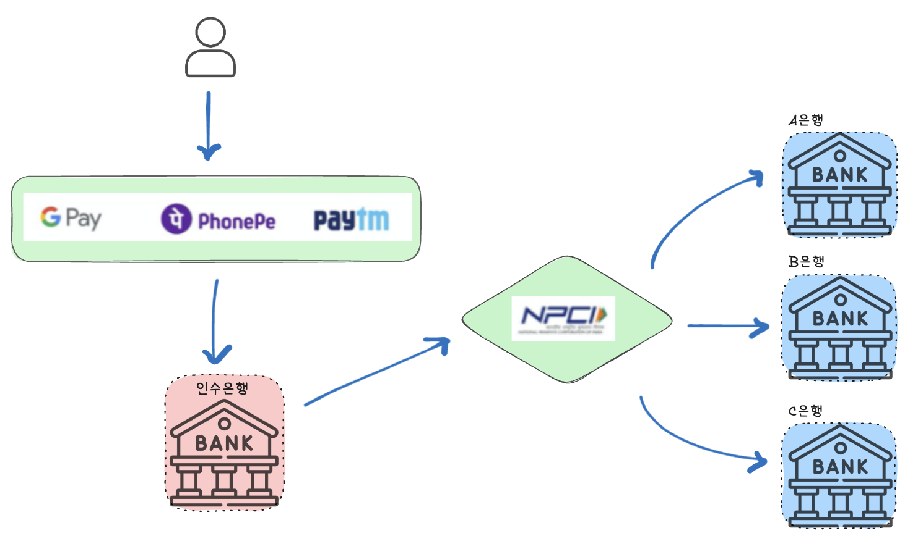

# 인도의 통합 결제 인터페이스(UPI)

## UPI란?
- Unified Payments Interface의 약자로, 인도에서 개발한 실시간으로 이루어지는 결제 시스템
- 현재 인도의 디지털 소매 거래 중 60%를 차지
- 결제 마크업 언어와 상호운용 결제 표준으로 구성

 

## UPI의 동작과정
## 1. 등록과정 (Registration)
Step 1: 사용자는 UPI 지원 결제 앱 (ex:Google Pay)을 다운로드합니다.  
Step 2: 사용자는 고유한 VPA(Virtual Payment Address)를 생성합니다. 
Step 3: UPI PIN(비밀번호)를 설정하고 결제앱과 은행계좌, 발급은행을 연결합니다 

 

## 2. 결제과정 (Transaction Process)
Step 1: 사용자는 송금또는 돈 받기를 요청합니다. 
Step 2: 사용자는 UPI PIN을 입력하여 거래를 진행합니다. 
Step 3: 결제앱은 NPCI과 연결된 네트워크를 통해 거래요청을 처리합니다 
    - 인수은행과 발급은행이 통신하여 실시간으로 금액을 이체합니다. 
Step 4: 거래 완료 

 
