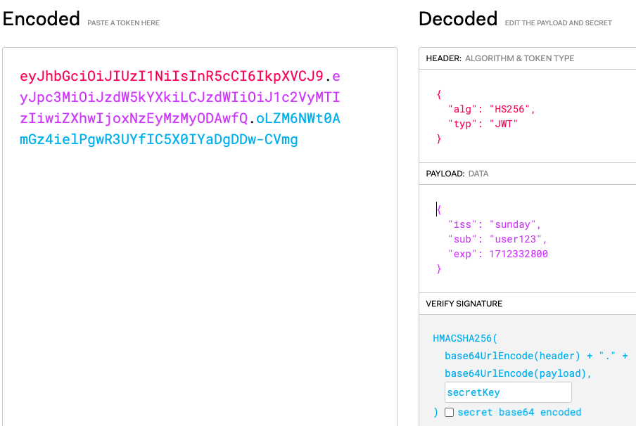

# JWT (JSON 웹 토큰)

## JWT란?
Json Web Token의 약자로 애플리케이션 간의 정보 교환을 위해 설계된 정보를 JSON 형식으로 포함하는 “자체포함형 토큰” 
- 자체 포함형 토큰이기 때문에 JWT만으로 모든 정보를 담고 있어 독립적으로 동작할 수 있고,  별도의 DB조회 없이 인증이나 사용자 권한을 확인할 수 있다.

- JWT의 구조는 HEADER.PAYLOAD.SIGNATURE 로 이루어져있으며, 
헤더, 내용, 서명이 ‘.(dot)’을 구분자로 하여 JWT 토큰 1개를 이룬다.

### JWT를 사용하는 이유
- stateless하다! -> 대용량 트래픽이 발생해도 대처 가능하다.
- 특정 DB/서버에 의존하지 않아도 인증할 수 있음 -> 서버 부담이 줄어든다.

### JWT의 단점
- 세션방식보다 비교적 많은 정보를 전송  ➡️ 네트워크 성능 저하가능성 있음
- 만료 관리 어려움 JWT는 발급 후 만료되기 전까지 유효하며 중간에 강제로 만료시키거나 철회하기 어려움 ➡️ 토큰 탈취 시 보안 문제가 발생
- 디코딩이 쉽다...➡️ 데이터 노출로 인한 보안적인 문제

---
 \

### HEADER
- 헤더에서는 해시 알고리즘과 토큰의 타입을 정의할 수 있다.

### PAYLOAD
- 내용에서는 전달하는 데이터와 발급/만료일(iat/exp) 을 포함할 수 있다.
- 데이터 각각의 Key를 claim이라고 부른다.

- claim에는 3가지 종류(registered, public, private)가 있으며 사용자가 원하는 Key와 Value로 구성할 수 있다.

    cf) iat, exp 는 registered claim!

    #### 주의!
    - PAYLOAD는 서명된 파트가 아닙니다!!! 단순히 base64로 인코딩된 파트이며 이는 누구나 디코딩하여 열람이 가능합니다.

### VERIFY SIGNATURE
- 헤더와 페이로드를 조합한 뒤 지정된 알고리즘으로 해시하고, 비밀키를 이용하여 서명한 결과이며 토큰의 위변조 여부를 확인하는데 사용되는 부분이다. 
- 헤더와 페이로드는 단순히 인코딩된 값이기 때문에 복호화가 매우 쉽지만 서명은 서버측에서 관리하는 비밀키가 유출되지않는 이상 복호화 할 수 없다.

 

---
