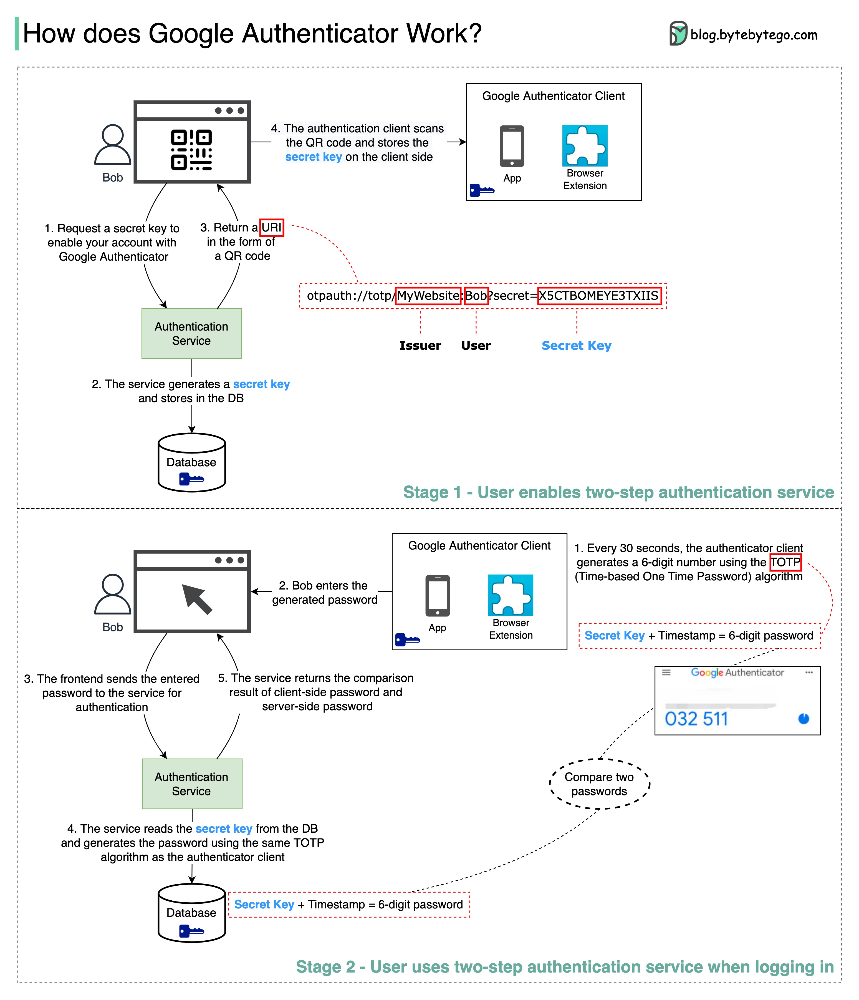

# Google Authenticator의 작동 방식

## Stage 1 - 사용자의 2단계 인증 서비스 활성화

1. Bob이 Google Authenticator로 계정을 활성화하기 위해 secret key를 요청
2. 인증 서비스가 secret key를 생성하고 데이터베이스에 저장
3. QR 코드 형태로 URI를 반환. 

> 💡URI의 구조  
형식: otpauth://totp/MyWebsite/Bob?secret=X5CTBOMEYE3TXI1S  
> - Issuer (MyWebsite): 서비스 제공자  
> - User (Bob): 사용자 식별자  
> - Secret Key (X5CTBOMEYE3TXI1S): 인증에 사용될 비밀키  

4. Google Authenticator 클라이언트(모바일 앱 또는 브라우저 확장프로그램)가 QR 코드를 스캔하고 secret key를 클라이언트 측에 저장

## Stage 2 - 로그인 시 2단계 인증 서비스 사용

1. Google Authenticator 클라이언트는 30초마다 TOTP(Time-based One Time Password) 알고리즘을 사용하여 6자리 숫자를 생성
   - 비밀번호 생성 공식: Secret Key + Timestamp = 6자리 비밀번호
   - 시간 기반으로 작동하여 30초마다 새로운 비밀번호가 생성됨

2. Bob이 생성된 6자리 비밀번호를 로그인 화면에 입력
3. 프론트엔드가 입력받은 비밀번호를 인증 서비스로 전송하여 검증을 요청
4. 서비스는 데이터베이스에서 해당 사용자의 secret key를 읽어와서, 클라이언트와 동일한 TOTP 알고리즘을 사용하여 비밀번호를 생성
   

   
추가 보안 기능

   

   동일한 공식 사용: Secret Key + Timestamp = 6자리 비밀번호
   
   - **다중 인증 계층**
      - TOTP는 일반적으로 2단계 인증(2FA)의 한 부분으로만 사용
      - 사용자의 기본 비밀번호가 첫 번째 방어선으로 작동
      - 즉, Secret Key가 노출되더라도 기본 비밀번호를 모르면 로그인 불가능
     - **Secret Key 보호 메커니즘**
        - 서버 측: 암호화된 형태로 저장
        - 클라이언트 측: 안전한 하드웨어 저장소 사용 (예: Android Keystore, iOS Keychain)
        - 전송 시: HTTPS를 통한 안전한 통신
     - **모니터링 및 제한**
        - 비정상적인 로그인 시도 감지
        - 일정 횟수 이상의 실패 시도 시 계정 잠금
        - 새로운 기기에서의 로그인 시도 시 추가 인증 요구
     - **Secret Key 재발급**
        - 보안 위협 감지 시 즉시 Secret Key 재발급 가능
        - 사용자가 디바이스 분실 시 즉시 재설정 가능
   
   

   

5. 서비스는 다음 두 가지를 비교하여 결과를 반환
   - 클라이언트 측에서 입력한 비밀번호
   - 서버 측에서 생성한 비밀번호

## 주요 보안 특징

1. Secret Key는 최초 1회만 교환되며, 이후에는 시간 정보만을 사용하여 비밀번호를 생성  
2. 30초마다 새로운 비밀번호가 생성되어 재사용이 불가능  
3. 클라이언트와 서버 간의 정확한 시간 동기화가 중요  
4. QR 코드를 통한 간편한 초기 설정이 가능  
5. 추가적인 보안 계층을 제공하여 단순 비밀번호 인증의 취약점을 보완  

=> 시간 기반의 일회용 비밀번호를 사용함으로써, 기존 비밀번호 방식의 취약점을 보완하고 높은 수준의 보안을 제공