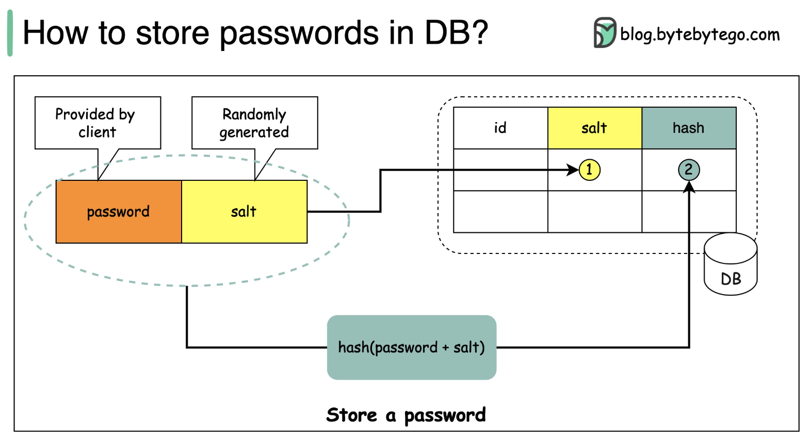
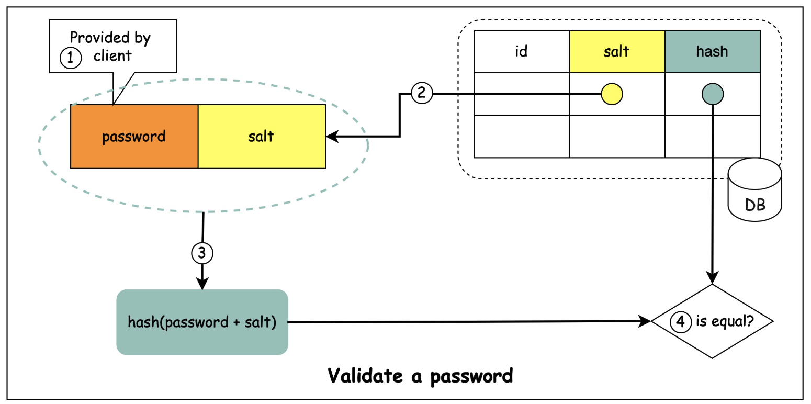

# 비밀번호의 안전한 저장과 검증
 

>비밀번호를 Hash함수를 통해 암호화한 값을 직접 데이터베이스에 저장하는 것은 안전하지 않다.
 
비밀번호 해시 값을 직접 저장하는 것은 rainbow table과 같은 사전 계산 공격에 취약하다는 단점이 존재한다.
 

## 비밀번호를 안전하게 저장하는 방법
salt를 사용하면 비밀번호를 보다 안전하게 저장할 수 있게된다. 
그렇다면, salt란 무엇일까?
>salt란 해시 과정에서 각 비밀번호에 추가되는 고유하고 무작위로 생성된 문자열이다. 
salt를 통해 사전 계산 공격 등을 방어할 수 있게되어 안전하게 비밀번호를 저장할 수 있다.

사용자가 입력한 비밀번호에 랜덤한 문자열값인 salt값을 더해 해시를 저장한다. 
이 때, salt값을 저장해야 비밀번호를 검증할 수 있기 때문에 반드시 저장해놓아야한다.
## salt를 사용해 저장한 비밀번호를 검증하는 방법

salt를 사용해 저장한 비밀번호를 검증하는 순서는 다음과 같다.
1. 클라이언트가 비밀번호를 입력한다.
2. DB에 저장해놓은 salt값을 가져온다.
3. 가져온 salt와 입력한 비밀번호를 더해 해시값을 구한다.
4. DB에 저장된 해시값과 계산한 해시값이 동일한지를 검증한다.